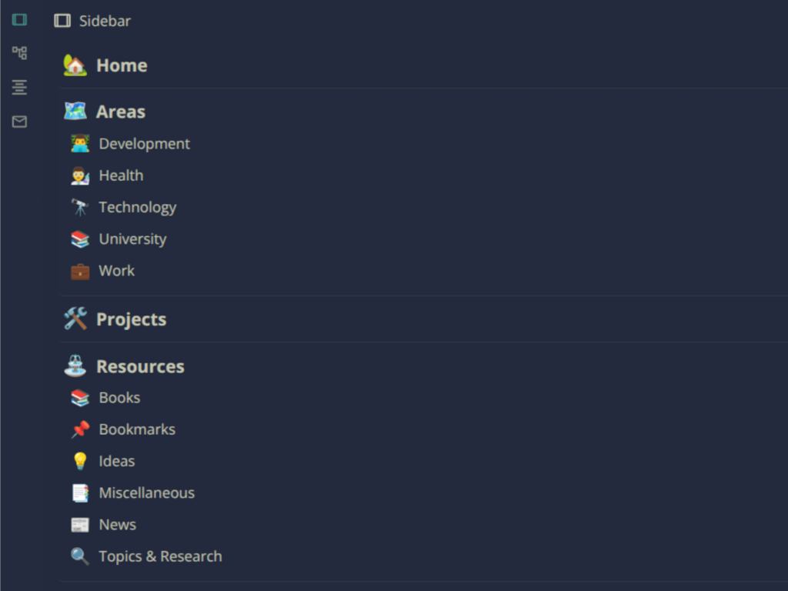

# Custom Sidebar Plugin for SiYuan

A powerful plugin that allows you to create a personalized dock with your favorite documents in SiYuan. Build your own custom sidebar with easy document management, drag-and-drop reordering, and expandable sections.

## Features

- 📁 **Custom Document Sections**: Add any document to your sidebar by copying its ID
- 🔄 **Drag & Drop Reordering**: Easily reorganize your sections with intuitive drag and drop
- 📂 **Expandable Sections**: Show/hide subdocuments with a single click
- 🎯 **Smart Icons**: Automatically displays document icons for easy identification
- 🌐 **Multi-language Support**: Available in English and Chinese
- 💾 **Persistent Storage**: Your sidebar configuration is automatically saved
- 🎨 **Theme Integration**: Seamlessly integrates with SiYuan's theme system

## Installation

1. Download the latest release from the [releases page](https://github.com/DD3Boh/custom-sidebar-siyuan/releases)
2. Extract the plugin files to your SiYuan plugins directory
3. Restart SiYuan or enable the plugin in Settings > Marketplace > Downloaded

You can also install the plugin in the regular way from the SiYuan Marketplace.

## Usage

### Adding Documents to Your Sidebar

1. Navigate to any document in SiYuan
2. Copy the document ID (you can find this in the document's URL or by right-clicking and selecting "Copy Block ID")
3. Click the "+" button in your custom sidebar
4. The document will be automatically added with its title, icon, and subdocuments

You can also use the "More" menu in the doctree near to the document you want to add to the Sidebar.

### Managing Your Sidebar

- **Reorder Sections**: Click and drag any section header to reorder
- **Expand/Collapse**: Click the expand/collapse icon to show/hide subdocuments
- **Remove Sections**: Click the trash button to remove a section
- **Navigate**: Click on any document to open it in SiYuan

### Keyboard Shortcuts

- `Ctrl+W`: Minimize the sidebar dock

## Configuration

The plugin automatically saves your sidebar configuration including:
- Document sections and their order
- Expansion state of each section

## Technical Details

### Built With

- **Vue 3**: Modern reactive UI framework
- **TypeScript**: Type-safe JavaScript development
- **Vite**: Fast build tool and development server
- **vue-draggable-plus**: Drag and drop functionality

## License

This project is licensed under the MIT License - see the [LICENSE](LICENSE) file for details.

## Support

If you find this plugin useful, consider supporting the development:

## Changelog

See [CHANGELOG.md](CHANGELOG.md) for a list of changes and updates.

## Acknowledgments

- Thanks to the SiYuan team for creating an excellent note-taking application and for the vite-vue plugin template
- Vue.js community for the excellent framework and ecosystem
